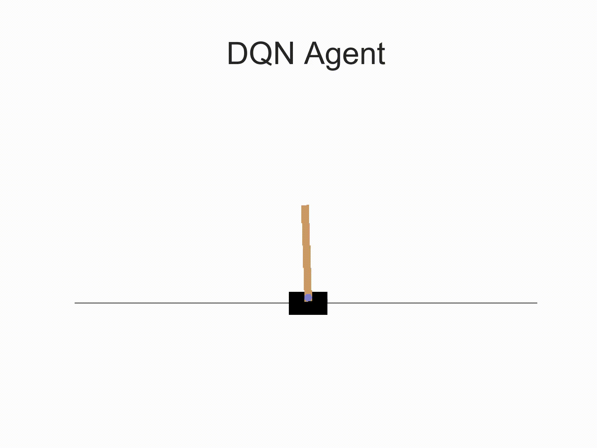
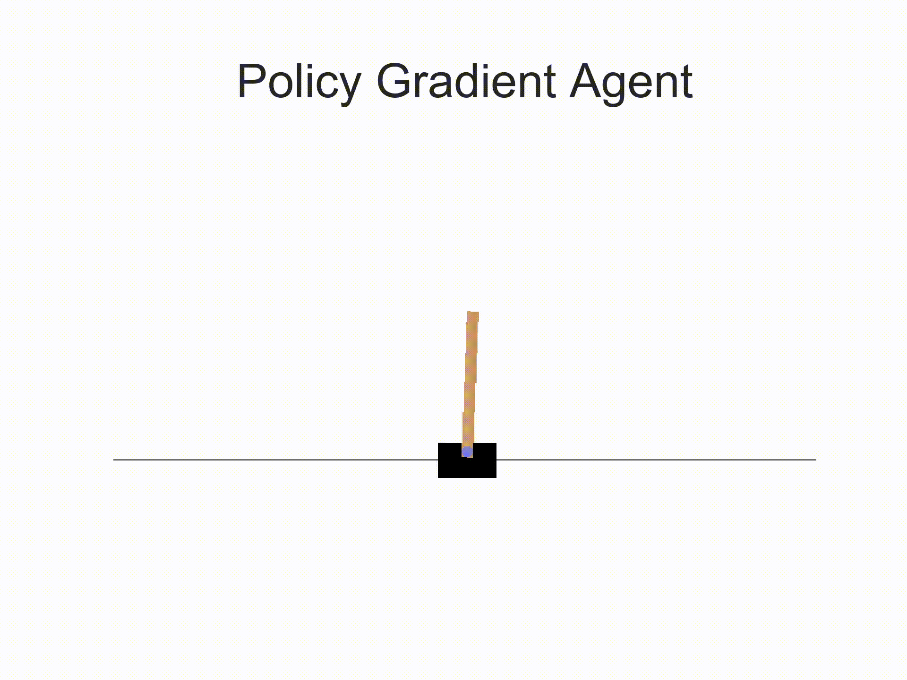
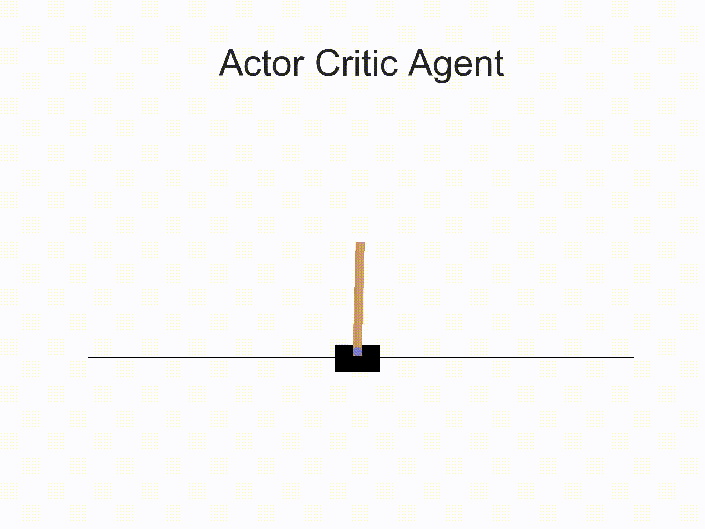
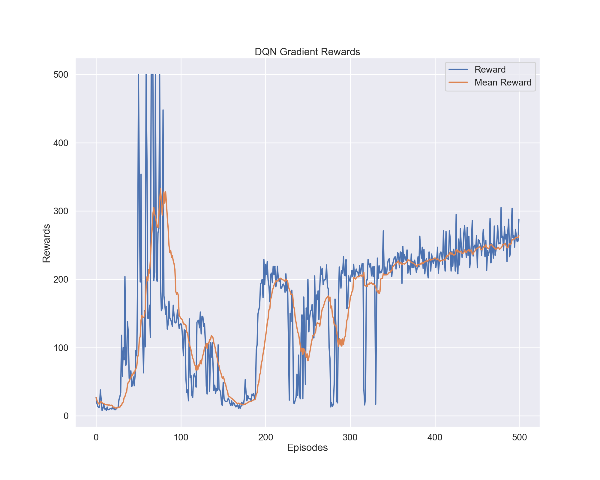
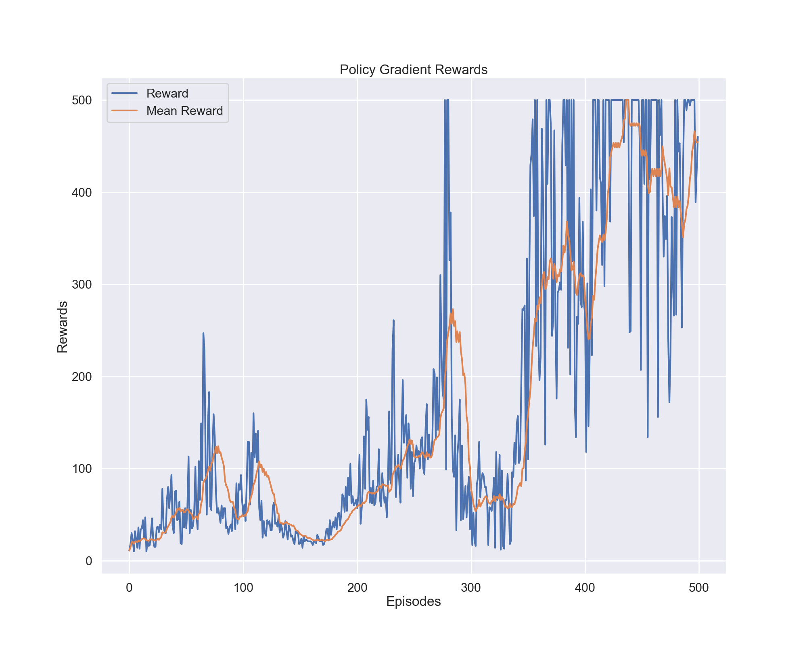
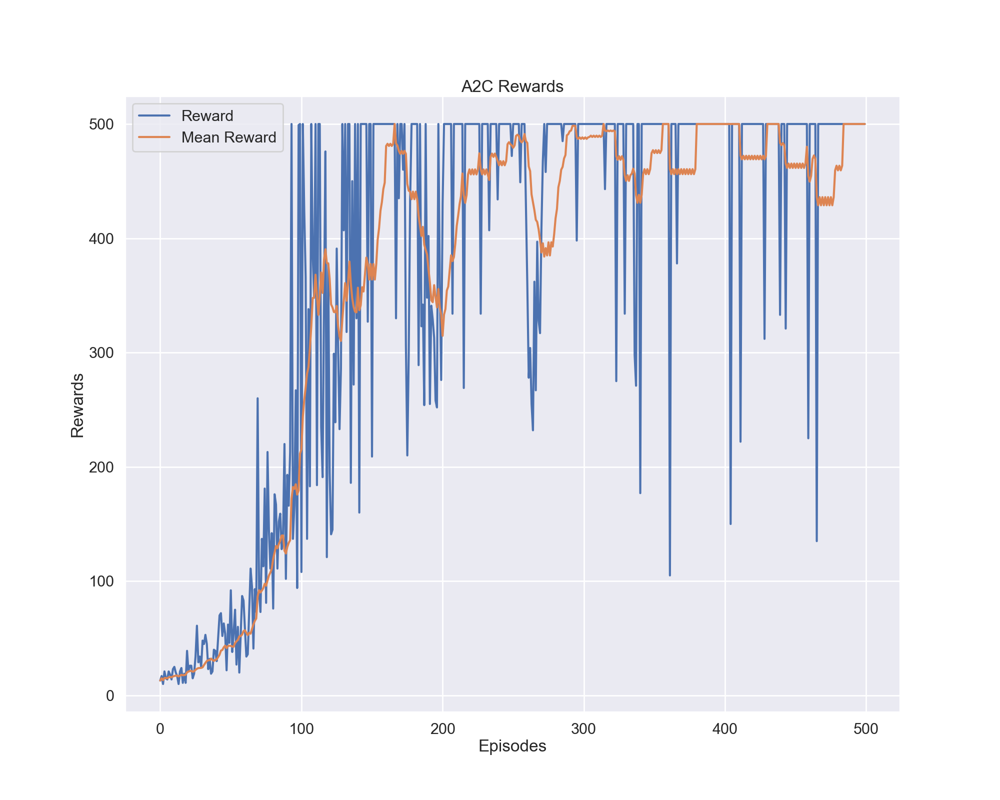

# Deep Reinforcement Learning with CartPole in Pytorch
## About
This repository explores 3 different Reinforcement Learning Algorithms using Deep Learning in Pytorch. The methods used here include Deep Q Learning (DQN), Policy Gradient Learning (REINFORCE), and Advantage Actor-Critic (A2C). The goal of the agent is to balance a pole on a cart for the maximum amount of time possible without it falling over. The task and documentation can be found at OpenAI Gym: https://gym.openai.com/envs/CartPole-v0/ 

  
  
  

## Models
### Model: DQN
The Deep Q-Network (DQN) is implemented as a simple feedforward network with two hidden layers of size 128 and 64, respectively. 

  
  

### Model: REINFORCE
The Policy-Gradient Network (REINFORCE) is implemented as a simple feedforward network with a single hidden layer of size 128 and output size equal to that of the action space. A dropout layer of 0.6 is placed in the intermediate layer.

  
  

### Model: A2C
The Advantage Actor-Critic (A2C) consists of 2 modules, an actor and a critic. The actor has a hidden layer of size 128 and output size equal to that of the action space. A dropout layer of 0.7 is placed in the intermediate layer. The critic has a hidden layer of size 128 and output size of 1. 

  
  

## Code
### Layout
Files are named in the format name-of-model.py and corresponding folders are name-of-model/, containing plots, models, and videos of trained agents performing the CartPole task.

### Run
The code is designed to be run easily and effectively for a wide variety of use cases. Knowing the flags is helpful in determining the appropriate command to run: 
* **--device**: cuda device, if one exists. Default 0
* **--verbose**: printing preferences, set to 1. Default 1
* **--load**: set to True if loading a model. If this is set to True, the model specified in directory flag --model is used. Default False
* **--save**: set to True if saving a model. Default False
* **--plot**: set to True if plotting the learning curves after training. Default True. 
* **--model**: the directory of the model to load, if --load Flag is set to True
* **--runtype**: choose from ('train_run', 'train', 'run'), corresponding with both training and running after training, training only, or running the model (consists of saving a video of the run). For training on a server without GLX support or where env.render() is unavailable, use 'train' only. Default 'train_run'
* **--lr**: the learning rate of the model. Defaults are different for different models.
* **--episodes**: the number of episodes for which the model will be trained
* **--gamma**: the discount factor

### Examples
Below are examples for how to run the code in a variety of use cases. Here, I'm using dqn_cartpole.py but the same formatting applies to the other two models as well. 

**Simple Train and Run (save output model, 500 episodes):** 

    python dqn_cartpole.py --save=True --episodes=500

**Train Only - useful for server-side training, to be rendered on a screen (save output model, 500 episodes):**

    python dqn_cartpole.py --runtype=train --episodes=500
    
**Load Existing Model (save output model, 500 episodes):**
    
    python dqn_cartpole.py --load=True --model= path/to/model --save=True --episodes=500

**Load Existing Model and Run Only:** 

    python dqn_cartpole.py --runtype=run --load=True --model = path/to/model --save=False

## References
Refer below for some fantastic tutorials on the topic, without which this code would not be possible:
* https://pytorch.org/tutorials/intermediate/reinforcement_q_learning.html
* https://towardsdatascience.com/understanding-actor-critic-methods-931b97b6df3f
* https://medium.com/@ts1829/policy-gradient-reinforcement-learning-in-pytorch-df1383ea0baf
* https://towardsdatascience.com/understanding-actor-critic-methods-931b97b6df3f
